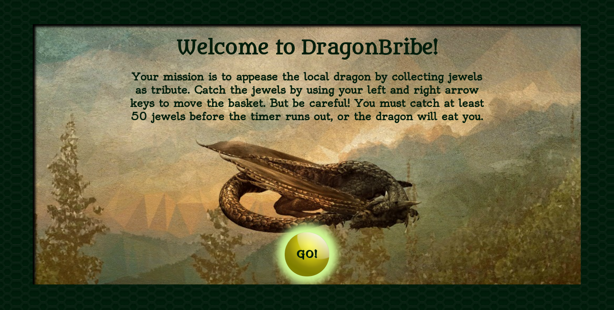

#DragonBribe

<a href="https://adrianaalter.github.io/DragonBribe/">DragonBribe</a> is a game written in vanilla JavaScript.  It includes CSS3 animations, and uses the HTML5 audio element to add sound effects and music.  The graphics were compiled using online photo editing software.  The play functionality uses the JavaScript setInterval() function, and a custom randomization algorithm, to generate jewels with random starting positions, speeds, and backgrounds.  

